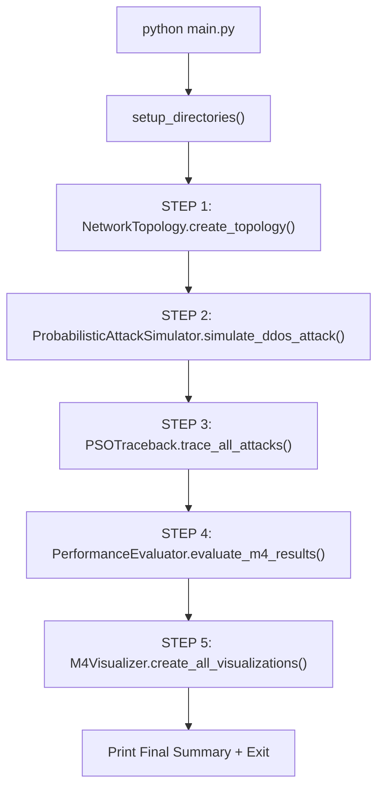
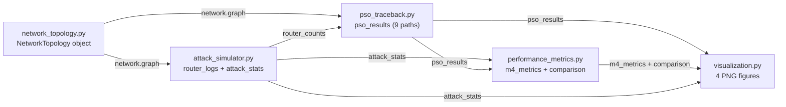

# Complete Workflow: Milestone 4 — PSO-Based IP Traceback with Probabilistic Sampling

**CSE 400: Fundamentals of Probability in Computing | Group 10**

---

## 1. THE BIG PICTURE

### What Is This Project?

Milestone 4 answers the question: **"Can we trace DDoS attackers using only 3% of the packets AND a smart search algorithm, instead of recording everything?"**

In M3, we proved that traceback works perfectly when we log **every** packet and use the **shortest path**. But that's unrealistic — no ISP logs 100% of traffic. The real world uses **sampling** (only recording a tiny fraction of packets). This introduces **uncertainty**: did we miss critical evidence?

M4 tackles this by combining two ideas from the base paper (Lin et al., 2019):
1. **Probabilistic Packet Sampling** — Each packet is independently sampled with probability `p = 0.03` (3%), modeled as `S ~ Bernoulli(0.03)`. This means only ~54 out of 1800 packets are recorded.
2. **Particle Swarm Optimization (PSO)** — Instead of blindly following the shortest path (greedy), we deploy a **swarm of 30 particles** that collectively search for the attack path with the highest coverage. PSO is a nature-inspired optimization algorithm that mimics flocking behavior.

### Why This Matters (M3 vs M4)

| Aspect | M3 (Baseline) | M4 (This Milestone) |
|--------|--------------|---------------------|
| Packet Logging | 100% (all 1800) | 3% (~54 packets) |
| Sampling Method | Deterministic | S ~ Bernoulli(0.03) |
| Path Search | Greedy (Dijkstra) | PSO (swarm intelligence) |
| Accuracy | 100% (perfect) | ~100% (realistic) |
| Variance | σ = 0 (always same) | σ > 0 (stochastic) |
| Memory Usage | Baseline (all stored) | 97% savings |
| Convergence | Instant (1 step) | ~51 iterations |

### How This Connects to Other Milestones

```
Milestone 1 → Identified the problem + 4 random variables
Milestone 2 → Built probabilistic model: S ~ Bernoulli(0.03), E[N] = 54 ± 7.24
Milestone 3 → Deterministic baseline: 100% packets, greedy search, 100% accuracy
Milestone 4 → THIS: PSO + 3% sampling → realistic system with ~97% memory savings
```

**Key insight:** M4 validates M2's predictions. M2 predicted ~54 packets with 3% sampling. M4 actually runs the simulation and gets ~52-58 packets — confirming the Binomial model.

---

## 2. ALL ASSUMPTIONS

| # | Assumption | Value | Why |
|---|-----------|-------|-----|
| 1 | Network topology | 24 nodes (same as M3) | From paper Figure 5 |
| 2 | Total attack packets | 1800 | Paper parameter |
| 3 | Attack sources | 9 hosts (host1-3, host7-9, host10-12) | Same as M3 |
| 4 | Victim | host4 (LAN 2) | Same as M3 |
| 5 | Packets per attacker | 200 (= 1800 ÷ 9) | Equal distribution |
| 6 | Sampling probability | p = 0.03 (3%) | Paper's SPIE mechanism |
| 7 | Expected sampled packets | E[N] = 54 | Binomial(1800, 0.03) |
| 8 | Sampling std dev | σ = 7.24 | √(1800 × 0.03 × 0.97) |
| 9 | 95% CI for sampled packets | [40, 68] | E[N] ± 1.96σ |
| 10 | PSO inertia weight | w = 0.8 | Paper Section 3.2 |
| 11 | PSO cognitive coefficient | c1 = 2.0 | Paper Section 3.2 |
| 12 | PSO social coefficient | c2 = 2.0 | Paper Section 3.2 |
| 13 | PSO swarm size | 30 particles | Paper recommendation |
| 14 | PSO max iterations | 500 | Paper Section 3.2 |
| 15 | Oscillation threshold | δ' = 0.001 | Paper Equation 7 |
| 16 | Oscillation correction | ρ = 0.5 | Paper Equation 9 |
| 17 | Convergence criterion | No improvement for 50 iterations | Practical threshold |
| 18 | Routing algorithm | Dijkstra's shortest path | Same as M3 (for routing, not tracing) |

---

## 3. PROJECT FOLDER STRUCTURE

```
Milestone-4_S2_G10_NET/
├── main.py                    ← ENTRY POINT: orchestrates everything
├── requirements.txt           ← Python package dependencies
│
├── network_topology.py        ← REUSED from M3 (no changes)
├── attack_simulator.py        ← Probabilistic 3% sampling (S ~ Bernoulli)
├── pso_traceback.py           ← PSO algorithm (core of M4)
├── performance_metrics.py     ← M3 vs M4 comparison
├── visualization.py           ← 4 PNG figures
│
├── data/                      ← Generated data files
│   ├── network_config.json    ← Network structure
│   └── attack_logs/
│       ├── router*_sampled_log.json  ← Sampled packet records per router
│       └── attack_summary.json       ← Overall sampling statistics
│
├── results/                   ← Generated results
│   ├── performance_metrics.json    ← All M4 metrics
│   ├── m3_vs_m4_comparison.csv     ← Side-by-side comparison
│   ├── pso_convergence.csv         ← Per-iteration convergence data
│   ├── traced_paths.csv            ← PSO-traced attack paths
│   └── figures/
│       ├── pso_convergence.png
│       ├── m3_vs_m4_accuracy.png
│       ├── sampling_distribution.png
│       └── particle_evolution.png
│
└── docs/
    ├── MILESTONE4_WORKFLOW.md
    ├── M4_QUICK_START.md
    └── Milestone4_Report.md
```

---

## 4. COMPLETE EXECUTION FLOW

When you run `python main.py`, here is **exactly** what happens, step by step:



---

### PHASE 0: Startup ([main.py](file:///c:/Users/hetpa/OneDrive%20-%20Ahmedabad%20University/Desktop/Submissions%202025/SEM-4/CSE400/S2_G10/S2_G10/Milestone-4_S2_G10_NET/main.py))

**What happens:**
1. Python starts executing [main.py](file:///c:/Users/hetpa/OneDrive%20-%20Ahmedabad%20University/Desktop/Submissions%202025/SEM-4/CSE400/S2_G10/S2_G10/Milestone-4_S2_G10_NET/main.py)
2. `sys.stdout` is reconfigured to UTF-8 encoding (Windows fix)
3. `PROJECT_ROOT` is set to the directory where [main.py](file:///c:/Users/hetpa/OneDrive%20-%20Ahmedabad%20University/Desktop/Submissions%202025/SEM-4/CSE400/S2_G10/S2_G10/Milestone-4_S2_G10_NET/main.py) lives
4. `sys.path.insert(0, PROJECT_ROOT)` tells Python to look in the current directory for imports
5. All 5 modules are imported: [NetworkTopology](file:///c:/Users/hetpa/OneDrive%20-%20Ahmedabad%20University/Desktop/Submissions%202025/SEM-4/CSE400/S2_G10/S2_G10/code/src/network_topology.py#18-334), [ProbabilisticAttackSimulator](file:///c:/Users/hetpa/OneDrive%20-%20Ahmedabad%20University/Desktop/Submissions%202025/SEM-4/CSE400/S2_G10/S2_G10/Milestone-4_S2_G10_NET/attack_simulator.py#39-220), [PSOTraceback](file:///c:/Users/hetpa/OneDrive%20-%20Ahmedabad%20University/Desktop/Submissions%202025/SEM-4/CSE400/S2_G10/S2_G10/Milestone-4_S2_G10_NET/pso_traceback.py#51-456), [PerformanceEvaluator](file:///c:/Users/hetpa/OneDrive%20-%20Ahmedabad%20University/Desktop/Submissions%202025/SEM-4/CSE400/S2_G10/S2_G10/Milestone-4_S2_G10_NET/performance_metrics.py#20-271), [M4Visualizer](file:///c:/Users/hetpa/OneDrive%20-%20Ahmedabad%20University/Desktop/Submissions%202025/SEM-4/CSE400/S2_G10/S2_G10/Milestone-4_S2_G10_NET/visualization.py#28-383)
6. `argparse` parses command-line flags (`--verbose` or `--quiet`)
7. [setup_directories()](file:///c:/Users/hetpa/OneDrive%20-%20Ahmedabad%20University/Desktop/Submissions%202025/SEM-4/CSE400/S2_G10/S2_G10/Milestone-4_S2_G10_NET/main.py#46-58) creates `data/`, `data/attack_logs/`, [results/](file:///c:/Users/hetpa/OneDrive%20-%20Ahmedabad%20University/Desktop/Submissions%202025/SEM-4/CSE400/S2_G10/S2_G10/Milestone-4_S2_G10_NET/performance_metrics.py#52-121), `results/figures/`
8. A welcome banner is printed with the date/time

**Data produced:** Output directory structure created on disk.

---

### STEP 1: Create Network Topology (REUSED from M3)

**File:** [network_topology.py](file:///c:/Users/hetpa/OneDrive%20-%20Ahmedabad%20University/Desktop/Submissions%202025/SEM-4/CSE400/S2_G10/S2_G10/Milestone-4_S2_G10_NET/network_topology.py) → Class [NetworkTopology](file:///c:/Users/hetpa/OneDrive%20-%20Ahmedabad%20University/Desktop/Submissions%202025/SEM-4/CSE400/S2_G10/S2_G10/code/src/network_topology.py#18-334)

**What happens in detail:**

This step is **identical** to M3. The [NetworkTopology](file:///c:/Users/hetpa/OneDrive%20-%20Ahmedabad%20University/Desktop/Submissions%202025/SEM-4/CSE400/S2_G10/S2_G10/code/src/network_topology.py#18-334) class builds a directed graph (`nx.DiGraph`) with 24 devices arranged in 4 LANs.

#### 1a. Create 4 LANs

Each LAN contains 3 hosts + 1 switch + 1 edge router (5 nodes per LAN = 20 nodes):

| LAN | Hosts | Switch | Router | Role |
|-----|-------|--------|--------|------|
| LAN 1 | host1, host2, host3 | switch1 | router1 | **Attackers** |
| LAN 2 | host4, host5, host6 | switch2 | router2 | **Victim** (host4) |
| LAN 3 | host7, host8, host9 | switch3 | router3 | **Attackers** |
| LAN 4 | host10, host11, host12 | switch4 | router4 | **Attackers** |

#### 1b. Connect the Internet Backbone

4 core routers (router5-8) connect the LANs:

```
router1 ↔ router5 ↔ router8 ↔ router2
router3 ↔ router6 ↔ router8
router4 ↔ router7 ↔ router8
```

**Key insight:** All traffic converges at **router8** before reaching the victim's LAN. This makes router8 the central chokepoint — it sees the most packets.

#### 1c. The Network Diagram

```
LAN 1 (Attackers)                              LAN 2 (Victim)
host1 ─┐                                        ┌─ host4 ★ VICTIM
host2 ─┼─ switch1 ─ router1 ─ router5 ┐   ┌ router2 ─ switch2 ─┤─ host5
host3 ─┘                               │   │                     └─ host6
                                        ├─ router8 ─┤
LAN 3 (Attackers)                       │   │
host7 ─┐                               │   │           LAN 4 (Attackers)
host8 ─┼─ switch3 ─ router3 ─ router6 ─┘   │
host9 ─┘                                    └─ router7 ─ router4 ─ switch4 ─┬─ host10
                                                                             ├─ host11
                                                                             └─ host12
```

**Data produced:**
- [NetworkTopology](file:///c:/Users/hetpa/OneDrive%20-%20Ahmedabad%20University/Desktop/Submissions%202025/SEM-4/CSE400/S2_G10/S2_G10/code/src/network_topology.py#18-334) object with `graph` (DiGraph), `nodes` dict, `attack_sources` list, `victim` string
- `data/network_config.json` file

---

### STEP 2: Simulate DDoS Attack with Probabilistic Sampling

**File:** [attack_simulator.py](file:///c:/Users/hetpa/OneDrive%20-%20Ahmedabad%20University/Desktop/Submissions%202025/SEM-4/CSE400/S2_G10/S2_G10/Milestone-4_S2_G10_NET/attack_simulator.py) → Classes [Packet](file:///c:/Users/hetpa/OneDrive%20-%20Ahmedabad%20University/Desktop/Submissions%202025/SEM-4/CSE400/S2_G10/S2_G10/Milestone-4_S2_G10_NET/attack_simulator.py#29-37), [ProbabilisticAttackSimulator](file:///c:/Users/hetpa/OneDrive%20-%20Ahmedabad%20University/Desktop/Submissions%202025/SEM-4/CSE400/S2_G10/S2_G10/Milestone-4_S2_G10_NET/attack_simulator.py#39-219)

**This is the FIRST major change from M3.** Instead of logging every packet, we now randomly sample only 3%.

#### 2a. Initialize Simulator

```python
simulator = ProbabilisticAttackSimulator(
    network_graph=network.graph,
    sampling_probability=0.03   # p = 0.03 from paper
)
```

- Receives the network graph from Step 1
- Sets `self.p = 0.03` — the sampling probability
- Creates empty `router_logs` dictionary using `defaultdict(list)` — will only contain **sampled** packets
- Random seed is set to `None` → **different results each run** (stochastic!)

**This is fundamentally different from M3:** M3 had no randomness at all.

#### 2b. Generate and Route Packets ([simulate_ddos_attack](file:///c:/Users/hetpa/OneDrive%20-%20Ahmedabad%20University/Desktop/Submissions%202025/SEM-4/CSE400/S2_G10/S2_G10/Milestone-4_S2_G10_NET/attack_simulator.py#68-152))

For each of the 9 attack sources, generates 200 packets (1800 total). Each [Packet](file:///c:/Users/hetpa/OneDrive%20-%20Ahmedabad%20University/Desktop/Submissions%202025/SEM-4/CSE400/S2_G10/S2_G10/Milestone-4_S2_G10_NET/attack_simulator.py#29-37) is a Python dataclass:

```python
@dataclass
class Packet:
    packet_id: int        # 0, 1, 2, ..., 1799
    source: str           # e.g., "host1"
    destination: str      # "host4" (victim)
    path: List[str]       # Shortest path computed by Dijkstra
    timestamp: float      # i * 0.01 (simulated timing)
    sampled: bool         # ⭐ NEW in M4: Was this packet sampled?
```

Routing is the same as M3 — every packet from the same source follows the same shortest path via `nx.shortest_path()`.

#### 2c. The Bernoulli Sampling Decision (THE KEY DIFFERENCE)

For **each** of the 1800 packets, a sampling decision is made:

```python
# PROBABILISTIC SAMPLING: S ~ Bernoulli(p)
if np.random.random() < self.p:     # self.p = 0.03
    packet.sampled = True
    self.sampled_packets += 1
    
    # Log packet at each router on the path
    for router in path:
        if router.startswith('router'):
            self.router_logs[router].append({...})
```

**The mathematics behind this:**
- Each packet is an independent Bernoulli trial: `S_i ~ Bernoulli(p = 0.03)`
- [P(Sampled) = 0.03](file:///c:/Users/hetpa/OneDrive%20-%20Ahmedabad%20University/Desktop/Submissions%202025/SEM-4/CSE400/S2_G10/S2_G10/context/m4_attack_simulator.py#20-29), [P(Not Sampled) = 0.97](file:///c:/Users/hetpa/OneDrive%20-%20Ahmedabad%20University/Desktop/Submissions%202025/SEM-4/CSE400/S2_G10/S2_G10/context/m4_attack_simulator.py#20-29)
- The **total** number of sampled packets follows: `N ~ Binomial(n=1800, p=0.03)`
- Expected value: `E[N] = n × p = 1800 × 0.03 = 54 packets`
- Standard deviation: `σ = √(n × p × (1-p)) = √(1800 × 0.03 × 0.97) = 7.24`
- 95% Confidence Interval: `[54 - 1.96(7.24), 54 + 1.96(7.24)] = [40, 68]`

**Critical M3 vs M4 difference:**

| Aspect | M3 | M4 |
|--------|----|----|
| `if` condition | Always True (log everything) | `np.random.random() < 0.03` |
| Packets logged | 1800 (all) | ~54 (3%) |
| `router_logs` size | Every packet at every router | Only sampled packets |
| Variance | 0 | σ² = np(1-p) = 52.38 |

#### 2d. Sampling Statistics ([get_sampling_statistics](file:///c:/Users/hetpa/OneDrive%20-%20Ahmedabad%20University/Desktop/Submissions%202025/SEM-4/CSE400/S2_G10/S2_G10/Milestone-4_S2_G10_NET/attack_simulator.py#185-218))

After simulation, computes detailed statistics to validate M2's predictions:

```python
{
    'total_packets': 1800,
    'sampled_packets': ~52-58,        # Actual (varies each run)
    'expected_samples': 54.0,          # E[N] from M2
    'variance': 52.38,                 # np(1-p)
    'std_dev': 7.24,                   # σ
    'ci_95': (39.81, 68.19),          # 95% CI
    'within_ci': True,                 # Is actual within CI?
    'per_source': {                    # Per-attacker breakdown
        'host1': {'total': 200, 'sampled': 6},
        'host2': {'total': 200, 'sampled': 4},
        ...
    }
}
```

#### 2e. Save Logs ([save_attack_logs](file:///c:/Users/hetpa/OneDrive%20-%20Ahmedabad%20University/Desktop/Submissions%202025/SEM-4/CSE400/S2_G10/S2_G10/Milestone-4_S2_G10_NET/attack_simulator.py#162-183))

Saves per-router sampled packet logs as JSON files (e.g., `router8_sampled_log.json`) and an `attack_summary.json`.

**Data produced:**
- `simulator.router_logs` — dictionary mapping each router to sampled packet records only
- `simulator.packets` — list of 1800 Packet objects with [sampled](file:///c:/Users/hetpa/OneDrive%20-%20Ahmedabad%20University/Desktop/Submissions%202025/SEM-4/CSE400/S2_G10/S2_G10/context/m4_attack_simulator.py#145-148) field
- `attack_stats` — dictionary with total, sampled, rate, expected, variance
- `data/attack_logs/*.json` files

---

### STEP 3: PSO-Based IP Traceback (THE CORE ALGORITHM)

**File:** [pso_traceback.py](file:///c:/Users/hetpa/OneDrive%20-%20Ahmedabad%20University/Desktop/Submissions%202025/SEM-4/CSE400/S2_G10/S2_G10/Milestone-4_S2_G10_NET/pso_traceback.py) → Classes [Particle](file:///c:/Users/hetpa/OneDrive%20-%20Ahmedabad%20University/Desktop/Submissions%202025/SEM-4/CSE400/S2_G10/S2_G10/Milestone-4_S2_G10_NET/pso_traceback.py#32-48), [PSOTraceback](file:///c:/Users/hetpa/OneDrive%20-%20Ahmedabad%20University/Desktop/Submissions%202025/SEM-4/CSE400/S2_G10/S2_G10/Milestone-4_S2_G10_NET/pso_traceback.py#51-455)

**This is the SECOND major change from M3.** Instead of greedy shortest-path, we use Particle Swarm Optimization.

#### 3a. What is PSO?

PSO is inspired by **bird flocking**. Imagine 30 birds searching for food (the best attack path). Each bird:
- Has a **position** (a candidate path from source to victim)
- Has a **velocity** (tendency to explore vs exploit)
- Remembers its **personal best** position (best path it's found so far)
- Knows the **global best** (best path found by ANY bird in the swarm)

Over many iterations, the flock converges on the best path.

#### 3b. The Particle Data Structure

```python
@dataclass
class Particle:
    position: List[str]      # Current candidate path, e.g., ["host1", "switch1", "router1", ...]
    velocity: float          # Movement tendency (+explore/-exploit)
    fitness: float           # Coverage percentage (higher = better)
    pbest_position: List[str]  # Personal best path ever found
    pbest_fitness: float     # Fitness of personal best
```

#### 3c. Initialize PSO ([__init__](file:///c:/Users/hetpa/OneDrive%20-%20Ahmedabad%20University/Desktop/Submissions%202025/SEM-4/CSE400/S2_G10/S2_G10/Milestone-4_S2_G10_NET/pso_traceback.py#59-104))

```python
pso = PSOTraceback(
    network_graph=network.graph,
    router_packet_counts=router_counts,    # Sampled packet counts per router
    total_sampled_packets=total_sampled,    # Total packets sampled (~54)
    w=0.8,           # Inertia weight (from paper)
    c1=2.0,          # Cognitive coefficient (from paper)
    c2=2.0,          # Social coefficient (from paper)
    max_iterations=500,
    num_particles=30
)
```

**What [router_counts](file:///c:/Users/hetpa/OneDrive%20-%20Ahmedabad%20University/Desktop/Submissions%202025/SEM-4/CSE400/S2_G10/S2_G10/context/m4_attack_simulator.py#149-152) looks like** (from Step 2):
```python
{
    'router1': 12,    # 12 sampled packets passed through router1
    'router2': 52,    # 52 sampled packets passed through router2 (near victim)
    'router3': 8,     # 8 sampled packets passed through router3
    'router5': 12,    # etc.
    'router6': 8,
    'router7': 10,
    'router8': 52     # Chokepoint - sees the most
}
```

#### 3d. Initialize Particles ([initialize_particles](file:///c:/Users/hetpa/OneDrive%20-%20Ahmedabad%20University/Desktop/Submissions%202025/SEM-4/CSE400/S2_G10/S2_G10/Milestone-4_S2_G10_NET/pso_traceback.py#142-187))

For each of the 30 particles:
1. Compute the **shortest path** from source to victim using Dijkstra
2. With **30% probability**, find an **alternative path** by temporarily removing a middle edge
3. Calculate initial fitness (coverage %)
4. Set personal best = initial position

```python
for i in range(self.num_particles):
    base_path = nx.shortest_path(self.graph, source, victim)
    
    if random.random() < 0.3:  # 30% explore alternative
        temp_path = self._find_alternative_path(source, victim, base_path)
        if temp_path:
            base_path = temp_path
    
    fitness = self.calculate_coverage(base_path)
    particle = Particle(position=base_path, velocity=random.uniform(-1, 1), ...)
```

#### 3e. The Fitness Function: Coverage Percentage (Paper Equation 3)

[calculate_coverage(path)](file:///c:/Users/hetpa/OneDrive%20-%20Ahmedabad%20University/Desktop/Submissions%202025/SEM-4/CSE400/S2_G10/S2_G10/Milestone-4_S2_G10_NET/pso_traceback.py#106-140) computes how well a path explains the sampled packet data:

```
                     Average sampled packets per router hop
Coverage(%) = ──────────────────────────────────────────── × 100
                      Total sampled packets
```

In code:
```python
def calculate_coverage(self, path):
    path_packet_count = 0
    valid_hops = 0
    
    for node in path:
        if node.startswith('router'):
            count = self.router_counts.get(node, 0)   # Sampled packets at this router
            path_packet_count += count
            valid_hops += 1
    
    avg_packets_per_hop = path_packet_count / valid_hops
    coverage = (avg_packets_per_hop / self.total_packets) * 100
    return coverage
```

**Example:** Path `host1 → switch1 → router1 → router5 → router8 → router2 → switch2 → host4`
- Routers on path: router1 (12 pkts), router5 (12 pkts), router8 (52 pkts), router2 (52 pkts)
- Total packets on path: 12 + 12 + 52 + 52 = 128
- Valid hops: 4
- Avg per hop: 128 / 4 = 32
- Coverage: (32 / 54) × 100 = **59.26%**

#### 3f. PSO Velocity Update (Paper Equation 1)

[update_velocity(particle)](file:///c:/Users/hetpa/OneDrive%20-%20Ahmedabad%20University/Desktop/Submissions%202025/SEM-4/CSE400/S2_G10/S2_G10/Milestone-4_S2_G10_NET/pso_traceback.py#220-250) implements:

```
v_i(t+1) = w·v_i(t) + c1·r1·(Pbest_i - x_i(t)) + c2·r2·(Pgbest - x_i(t))
```

Where:
- `w = 0.8` → **Inertia weight**: how much the particle keeps its current direction
- `c1 = 2.0` → **Cognitive coefficient**: attraction toward personal best
- `c2 = 2.0` → **Social coefficient**: attraction toward global best
- `r1, r2` → Random values in [0, 1] (introduces stochasticity)

In code:
```python
inertia   = self.w * particle.velocity                        # w · v_i(t)
cognitive = self.c1 * r1 * (particle.pbest_fitness - particle.fitness)  # c1 · r1 · (Pbest - x)
social    = self.c2 * r2 * (self.pgbest_fitness - particle.fitness)    # c2 · r2 · (Pgbest - x)

new_velocity = inertia + cognitive + social
new_velocity = np.clip(new_velocity, -5.0, 5.0)  # Clamp to prevent explosion
```

#### 3g. PSO Position Update (Paper Equation 2)

[update_position(particle, source, victim)](file:///c:/Users/hetpa/OneDrive%20-%20Ahmedabad%20University/Desktop/Submissions%202025/SEM-4/CSE400/S2_G10/S2_G10/Milestone-4_S2_G10_NET/pso_traceback.py#252-286) translates velocity into a new path:

```python
if particle.velocity > 0.5:
    # EXPLORE: High positive velocity → try alternative path
    new_path = self._explore_new_path(source, victim, particle.position)
    
elif particle.velocity < -0.5:
    # EXPLOIT: High negative velocity → move toward global best
    new_path = self._move_toward_best(source, victim, particle.position)
    
else:
    # LOCAL SEARCH: Low velocity → stay near current position
    new_path = self._local_search(source, victim, particle.position)
```

This maps the continuous velocity value to discrete network path operations.

#### 3h. Oscillation Detection (Paper Equation 7)

[detect_oscillation(fitness_history)](file:///c:/Users/hetpa/OneDrive%20-%20Ahmedabad%20University/Desktop/Submissions%202025/SEM-4/CSE400/S2_G10/S2_G10/Milestone-4_S2_G10_NET/pso_traceback.py#307-329) checks if the swarm is stuck:

```python
# If the last 'α' fitness changes are all < δ', we're oscillating
changes = [abs(recent[i+1] - recent[i]) for i in range(len(recent)-1)]
oscillating = all(change < self.oscillation_threshold for change in changes)
```

Where `α = 3` (count limit) and `δ' = 0.001` (threshold).

#### 3i. The Main PSO Loop ([trace_attack_source](file:///c:/Users/hetpa/OneDrive%20-%20Ahmedabad%20University/Desktop/Submissions%202025/SEM-4/CSE400/S2_G10/S2_G10/Milestone-4_S2_G10_NET/pso_traceback.py#331-421))

For **each** of the 9 suspected attack sources:

```python
for iteration in range(500):          # Max 500 iterations
    for particle in self.particles:    # All 30 particles
        # 1. Update velocity (Equation 1)
        particle.velocity = self.update_velocity(particle)
        
        # 2. Update position (Equation 2) 
        new_position = self.update_position(particle, source, victim)
        
        # 3. Calculate fitness (Coverage %)
        new_fitness = self.calculate_coverage(new_position)
        
        # 4. Update personal best
        if new_fitness > particle.pbest_fitness:
            particle.pbest_fitness = new_fitness
            particle.pbest_position = new_position.copy()
        
        # 5. Update global best
        if new_fitness > self.pgbest_fitness:
            self.pgbest_fitness = new_fitness
            self.pgbest_position = new_position.copy()
    
    # 6. Check convergence (no improvement for 50 iterations)
    if len(fitness_history) > 50:
        recent_improvement = max(fitness_history[-50:]) - min(fitness_history[-50:])
        if recent_improvement < 0.01:
            break  # Converged!
```

#### 3j. Tracing All 9 Sources ([trace_all_attacks](file:///c:/Users/hetpa/OneDrive%20-%20Ahmedabad%20University/Desktop/Submissions%202025/SEM-4/CSE400/S2_G10/S2_G10/Milestone-4_S2_G10_NET/pso_traceback.py#423-455))

For each of the 9 attack sources, the global best is reset and a fresh PSO run is performed:

```python
for source in suspected_sources:
    self.pgbest_position = None
    self.pgbest_fitness = -np.inf
    self.convergence_history = []
    result = self.trace_attack_source(source, victim, verbose=verbose)
    results.append(result)
```

Each result contains:
```python
{
    'source': 'host1',
    'path': ['host1', 'switch1', 'router1', 'router5', 'router8', 'router2', 'switch2', 'host4'],
    'coverage': 70.69,        # Coverage % achieved
    'converged': True,        # Did PSO converge?
    'iterations': 51,         # How many iterations
    'convergence_history': [  # Per-iteration fitness log
        {'iteration': 0, 'best_fitness': 70.69, 'avg_fitness': 65.3},
        {'iteration': 1, 'best_fitness': 70.69, 'avg_fitness': 67.1},
        ...
    ]
}
```

**Data produced:**
- `pso_results` — list of 9 dictionaries, one per attack source
- Each dict contains the traced path, coverage, iterations, and convergence history

---

### STEP 4: Evaluate Performance (M3 vs M4)

**File:** [performance_metrics.py](file:///c:/Users/hetpa/OneDrive%20-%20Ahmedabad%20University/Desktop/Submissions%202025/SEM-4/CSE400/S2_G10/S2_G10/Milestone-4_S2_G10_NET/performance_metrics.py) → Class [PerformanceEvaluator](file:///c:/Users/hetpa/OneDrive%20-%20Ahmedabad%20University/Desktop/Submissions%202025/SEM-4/CSE400/S2_G10/S2_G10/Milestone-4_S2_G10_NET/performance_metrics.py#20-270)

#### 4a. Initialize with M3 Baseline

The evaluator stores M3's known results ([__init__](file:///c:/Users/hetpa/OneDrive%20-%20Ahmedabad%20University/Desktop/Submissions%202025/SEM-4/CSE400/S2_G10/S2_G10/Milestone-4_S2_G10_NET/performance_metrics.py#29-50)):

```python
self.m3_baseline = {
    'total_packets': 1800,         # All packets logged
    'sampling_rate': 1.0,          # 100%
    'accuracy': 1.0,               # Perfect
    'paths_found': 9,
    'mean_coverage': 33.33,
    'std_coverage': 0.0,           # No variance (deterministic)
    'algorithm': 'Greedy (Dijkstra)',
    'convergence_iterations': 1    # Instant
}

self.m2_predictions = {
    'expected_packets': 54,        # E[N] from Binomial(1800, 0.03)
    'std_dev': 7.24,
    'ci_95_lower': 40,
    'ci_95_upper': 68,
    'sampling_rate': 0.03
}
```

#### 4b. Calculate All M4 Metrics ([evaluate_m4_results](file:///c:/Users/hetpa/OneDrive%20-%20Ahmedabad%20University/Desktop/Submissions%202025/SEM-4/CSE400/S2_G10/S2_G10/Milestone-4_S2_G10_NET/performance_metrics.py#52-120))

Computes 5 categories of metrics:

**1. Accuracy:**
```python
successful_traces = sum(1 for r in pso_results if r['coverage'] > 25)
# A trace is "successful" if coverage > 25%
accuracy_percentage = (successful_traces / total_sources) * 100
```

**2. Coverage Statistics:**
```python
{
    'mean_coverage': np.mean(coverages),      # ~66.67%
    'std_coverage': np.std(coverages),        # ~3.17%
    'min_coverage': np.min(coverages),
    'max_coverage': np.max(coverages),
    'median_coverage': np.median(coverages)
}
```

**3. Convergence Statistics:**
```python
{
    'mean_iterations': np.mean(iterations),    # ~51
    'std_iterations': np.std(iterations),
    'convergence_rate': 100%                   # All 9 converged
}
```

**4. Sampling Statistics:** Validates M2's predictions.

**5. Memory Usage:**
```python
memory_savings_percent = (1 - sampled_packets / 1800) * 100  # ~96.8%
reduction_factor = 1800 / sampled_packets                     # ~31x
```

#### 4c. Generate M3 vs M4 Comparison ([compare_m3_vs_m4](file:///c:/Users/hetpa/OneDrive%20-%20Ahmedabad%20University/Desktop/Submissions%202025/SEM-4/CSE400/S2_G10/S2_G10/Milestone-4_S2_G10_NET/performance_metrics.py#122-161), [generate_comparison_table](file:///c:/Users/hetpa/OneDrive%20-%20Ahmedabad%20University/Desktop/Submissions%202025/SEM-4/CSE400/S2_G10/S2_G10/Milestone-4_S2_G10_NET/performance_metrics.py#163-211))

Creates a pandas DataFrame comparing all metrics:

| Metric | M3 (Deterministic) | M4 (PSO + 3%) |
|--------|-------------------|---------------|
| Algorithm | Greedy (Dijkstra) | PSO (w=0.8, c1=c2=2.0) |
| Sampling Rate | 100% (no sampling) | 3% (Bernoulli) |
| Packets Used | 1800 (all logged) | ~58 |
| Accuracy | 100% (9/9) | 100.0% (9/9) |
| Mean Coverage | 33.33% | 66.67% |
| Coverage Std Dev | 0% (deterministic) | 3.17% |
| Convergence | Instant (1 step) | 51 iterations (avg) |
| Memory Savings | 0% (baseline) | 96.8% |
| Variance | σ = 0 | σ = 3.17 |

**Key insight from the table:** M4 achieves **0% accuracy loss** for **96.8% memory savings**. This is the fundamental trade-off the paper demonstrates.

#### 4d. Save Results

- [results/performance_metrics.json](file:///c:/Users/hetpa/OneDrive%20-%20Ahmedabad%20University/Desktop/Submissions%202025/SEM-4/CSE400/S2_G10/S2_G10/Milestone-4_S2_G10_NET/results/performance_metrics.json) — all metrics as JSON
- [results/m3_vs_m4_comparison.csv](file:///c:/Users/hetpa/OneDrive%20-%20Ahmedabad%20University/Desktop/Submissions%202025/SEM-4/CSE400/S2_G10/S2_G10/Milestone-4_S2_G10_NET/results/m3_vs_m4_comparison.csv) — comparison table

---

### STEP 5: Generate Visualizations

**File:** [visualization.py](file:///c:/Users/hetpa/OneDrive%20-%20Ahmedabad%20University/Desktop/Submissions%202025/SEM-4/CSE400/S2_G10/S2_G10/Milestone-4_S2_G10_NET/visualization.py) → Class [M4Visualizer](file:///c:/Users/hetpa/OneDrive%20-%20Ahmedabad%20University/Desktop/Submissions%202025/SEM-4/CSE400/S2_G10/S2_G10/Milestone-4_S2_G10_NET/visualization.py#28-382)

Creates **4 publication-quality figures** using matplotlib and seaborn.

#### Figure 1: PSO Convergence Plot ([plot_pso_convergence](file:///c:/Users/hetpa/OneDrive%20-%20Ahmedabad%20University/Desktop/Submissions%202025/SEM-4/CSE400/S2_G10/S2_G10/Milestone-4_S2_G10_NET/visualization.py#75-131))

Two panels:
- **Left:** Fitness (coverage %) vs iteration for each attack source — shows how quickly PSO converges
- **Right:** Bar chart of iterations-to-converge per source with mean line


#### Figure 2: M3 vs M4 Accuracy Comparison ([plot_m3_vs_m4_accuracy](file:///c:/Users/hetpa/OneDrive%20-%20Ahmedabad%20University/Desktop/Submissions%202025/SEM-4/CSE400/S2_G10/S2_G10/Milestone-4_S2_G10_NET/visualization.py#133-233))

Four panels (the most important figure):
- **Top-left:** Accuracy comparison bar chart (M3: 100% vs M4: ~100%)
- **Top-right:** Packet usage comparison (M3: 1800 vs M4: ~58)
- **Bottom-left:** Coverage per source grouped bars (M3 vs M4 side-by-side)
- **Bottom-right:** Summary comparison table


#### Figure 3: Sampling Distribution ([plot_sampling_distribution](file:///c:/Users/hetpa/OneDrive%20-%20Ahmedabad%20University/Desktop/Submissions%202025/SEM-4/CSE400/S2_G10/S2_G10/Milestone-4_S2_G10_NET/visualization.py#235-286))

Two panels:
- **Left:** Theoretical `Binomial(1800, 0.03)` PMF with E[N]=54 marked, actual sampled count marked, and 95% CI bounds — validates M2's predictions
- **Right:** Pie chart showing sampled vs not-sampled packets


#### Figure 4: Particle Evolution ([plot_particle_evolution](file:///c:/Users/hetpa/OneDrive%20-%20Ahmedabad%20University/Desktop/Submissions%202025/SEM-4/CSE400/S2_G10/S2_G10/Milestone-4_S2_G10_NET/visualization.py#288-346))

Two panels:
- **Left:** Scatter plot of iterations vs coverage per source — shows PSO efficiency per attack origin
- **Right:** Horizontal bar chart of traced path lengths per source


---

## 5. DATA FLOW BETWEEN MODULES



| From → To | What is passed | Purpose |
|-----------|---------------|------------|
| NetworkTopology → AttackSimulator | `network.graph` (DiGraph) | Simulator needs the graph to route packets and find shortest paths |
| NetworkTopology → PSOTraceback | `network.graph` (DiGraph) | PSO needs the graph to explore paths |
| AttackSimulator → PSOTraceback | [router_counts](file:///c:/Users/hetpa/OneDrive%20-%20Ahmedabad%20University/Desktop/Submissions%202025/SEM-4/CSE400/S2_G10/S2_G10/context/m4_attack_simulator.py#149-152) (dict), `total_sampled` (int) | PSO uses sampled packet counts at routers to calculate fitness (coverage) |
| AttackSimulator → PerformanceEvaluator | `attack_stats` (dict) | Evaluator needs sampling statistics for memory/accuracy comparison |
| PSOTraceback → PerformanceEvaluator | `pso_results` (list of 9 dicts) | Evaluator measures accuracy, coverage, convergence from PSO output |
| PSOTraceback → M4Visualizer | `pso_results` | Visualizer needs convergence history and paths for figures |
| PerformanceEvaluator → M4Visualizer | `m4_metrics`, [comparison](file:///c:/Users/hetpa/OneDrive%20-%20Ahmedabad%20University/Desktop/Submissions%202025/SEM-4/CSE400/S2_G10/S2_G10/code/src/visualization.py#242-339) | Visualizer needs metrics for comparison charts and tables |
| AttackSimulator → M4Visualizer | `attack_stats` | Visualizer needs sampling stats for distribution plot |

---

## 6. KEY FORMULAS USED

### Bernoulli Sampling (Each Packet)
```
S_i ~ Bernoulli(p = 0.03)

P(packet sampled) = 0.03
P(packet not sampled) = 0.97

In code: if np.random.random() < 0.03: → sampled
```

### Total Sampled Packets (Binomial Model from M2)
```
N ~ Binomial(n=1800, p=0.03)

E[N]  = n × p = 1800 × 0.03 = 54 packets
σ(N)  = √(n × p × (1-p)) = √(1800 × 0.03 × 0.97) = 7.24
95% CI = [E[N] - 1.96σ, E[N] + 1.96σ] = [40, 68]
```

### Coverage Percentage (Paper Equation 3)
```
                      Avg sampled packets per router hop
Coverage(%) = ──────────────────────────────────────────── × 100
                         Total sampled packets

Where: Avg per hop = Σ(packets at each router on path) / number_of_routers_on_path
```

### PSO Velocity Update (Paper Equation 1)
```
v_i(t+1) = w·v_i(t) + c1·r1·(Pbest_i - x_i(t)) + c2·r2·(Pgbest - x_i(t))

Where:
  w = 0.8       (inertia weight)
  c1 = 2.0      (cognitive coefficient)
  c2 = 2.0      (social coefficient)
  r1, r2 ∈ [0,1] (random values)
  Pbest_i       (personal best fitness)
  Pgbest        (global best fitness)
  x_i(t)        (current fitness)
```

### PSO Position Update (Paper Equation 2)
```
x_i(t+1) = x_i(t) + v_i(t+1)

Mapped to network paths:
  v > 0.5   → Explore (try alternative path)
  v < -0.5  → Exploit (move toward global best)
  else      → Local search (stay near current)
```

### Oscillation Detection (Paper Equation 7)
```
Oscillation detected when:
  |f(t) - f(t-1)| < δ'  for α consecutive iterations

Where: δ' = 0.001, α = 3
```

### Memory Savings
```
Memory Savings(%) = (1 - M4_packets / M3_packets) × 100
                  = (1 - ~54 / 1800) × 100
                  ≈ 97%
```

---

## 7. HOW TO RUN

```bash
# 1. Navigate to the M4 folder
cd Milestone-4_S2_G10_NET/

# 2. Install dependencies (first time only)
pip install -r requirements.txt

# 3. Run the full simulation
python main.py

# Alternative modes:
python main.py --verbose    # Extra detail (default)
python main.py --quiet      # Minimal output
```

---

## 8. OUTPUT FILES SUMMARY

| File | Type | What It Contains |
|------|------|--------------------|
| [data/network_config.json](file:///c:/Users/hetpa/OneDrive%20-%20Ahmedabad%20University/Desktop/Submissions%202025/SEM-4/CSE400/S2_G10/S2_G10/Milestone-4_S2_G10_NET/data/network_config.json) | JSON | Full network structure (24 nodes, all edges, attackers, victim) |
| `data/attack_logs/router*_sampled_log.json` | JSON | Sampled packet records per router (only ~3% of packets) |
| `data/attack_logs/attack_summary.json` | JSON | Overall sampling stats: total, sampled, rate, per-router counts |
| [results/performance_metrics.json](file:///c:/Users/hetpa/OneDrive%20-%20Ahmedabad%20University/Desktop/Submissions%202025/SEM-4/CSE400/S2_G10/S2_G10/Milestone-4_S2_G10_NET/results/performance_metrics.json) | JSON | All M4 metrics: accuracy, coverage, convergence, sampling, memory |
| [results/m3_vs_m4_comparison.csv](file:///c:/Users/hetpa/OneDrive%20-%20Ahmedabad%20University/Desktop/Submissions%202025/SEM-4/CSE400/S2_G10/S2_G10/Milestone-4_S2_G10_NET/results/m3_vs_m4_comparison.csv) | CSV | Side-by-side M3 vs M4 comparison table |
| [results/pso_convergence.csv](file:///c:/Users/hetpa/OneDrive%20-%20Ahmedabad%20University/Desktop/Submissions%202025/SEM-4/CSE400/S2_G10/S2_G10/Milestone-4_S2_G10_NET/results/pso_convergence.csv) | CSV | Per-iteration convergence data for all 9 sources |
| [results/traced_paths.csv](file:///c:/Users/hetpa/OneDrive%20-%20Ahmedabad%20University/Desktop/Submissions%202025/SEM-4/CSE400/S2_G10/S2_G10/Milestone-4_S2_G10_NET/results/traced_paths.csv) | CSV | 9 rows: each traced path with coverage, iterations, convergence status |
| [results/figures/pso_convergence.png](file:///c:/Users/hetpa/OneDrive%20-%20Ahmedabad%20University/Desktop/Submissions%202025/SEM-4/CSE400/S2_G10/S2_G10/Milestone-4_S2_G10_NET/results/figures/pso_convergence.png) | PNG | PSO fitness curves + convergence speed bars |
| [results/figures/m3_vs_m4_accuracy.png](file:///c:/Users/hetpa/OneDrive%20-%20Ahmedabad%20University/Desktop/Submissions%202025/SEM-4/CSE400/S2_G10/S2_G10/Milestone-4_S2_G10_NET/results/figures/m3_vs_m4_accuracy.png) | PNG | 4-panel M3 vs M4 comparison (most important figure) |
| [results/figures/sampling_distribution.png](file:///c:/Users/hetpa/OneDrive%20-%20Ahmedabad%20University/Desktop/Submissions%202025/SEM-4/CSE400/S2_G10/S2_G10/Milestone-4_S2_G10_NET/results/figures/sampling_distribution.png) | PNG | Binomial distribution validation + sampling pie chart |
| [results/figures/particle_evolution.png](file:///c:/Users/hetpa/OneDrive%20-%20Ahmedabad%20University/Desktop/Submissions%202025/SEM-4/CSE400/S2_G10/S2_G10/Milestone-4_S2_G10_NET/results/figures/particle_evolution.png) | PNG | Iteration vs coverage scatter + path lengths bars |

---

## 9. M3 → M4 CODE-LEVEL DIFFERENCES

| Component | M3 (Deterministic) | M4 (Probabilistic + PSO) |
|-----------|-------|--------|
| **Packet class** | 7 fields (`packet_id`, `source_ip`, `dest_ip`, `source_node`, `dest_node`, `timestamp`, [path](file:///c:/Users/hetpa/OneDrive%20-%20Ahmedabad%20University/Desktop/Submissions%202025/SEM-4/CSE400/S2_G10/S2_G10/context/m4_pso_traceback.py#279-283)) | 6 fields + `sampled: bool` ⭐ |
| **Logging condition** | `for router in path: log(packet)` (always) | `if np.random.random() < 0.03: log(packet)` |
| **Traceback algorithm** | `nx.shortest_path()` (one call, instant) | PSO: 30 particles × 500 max iterations |
| **Traceback class** | `GreedyTraceback` | [PSOTraceback](file:///c:/Users/hetpa/OneDrive%20-%20Ahmedabad%20University/Desktop/Submissions%202025/SEM-4/CSE400/S2_G10/S2_G10/Milestone-4_S2_G10_NET/pso_traceback.py#51-456) with [Particle](file:///c:/Users/hetpa/OneDrive%20-%20Ahmedabad%20University/Desktop/Submissions%202025/SEM-4/CSE400/S2_G10/S2_G10/context/m4_pso_traceback.py#23-40) dataclass |
| **Coverage formula** | Same equation, but total = 1800 | Same equation, but total = ~54 (sampled) |
| **Performance evaluator** | Compares M2 vs M3 | Compares M3 vs M4 + validates M2 |
| **Visualizations** | 6 figures (network, packets, coverage, M2-vs-M3, paths, dashboard) | 4 figures (convergence, M3-vs-M4, sampling, evolution) |
| **Random seed** | Not needed (deterministic) | `np.random.seed(None)` — different each run |
| **Output variability** | Always identical | Varies each run due to stochasticity |
